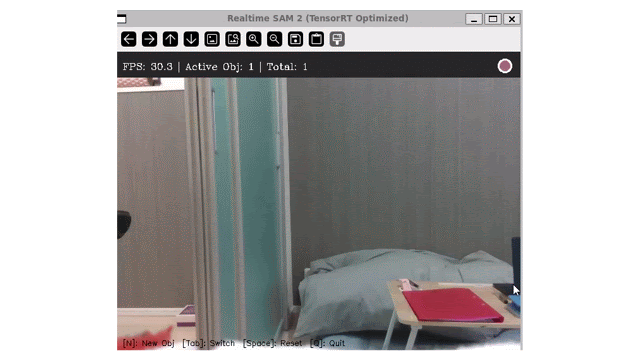
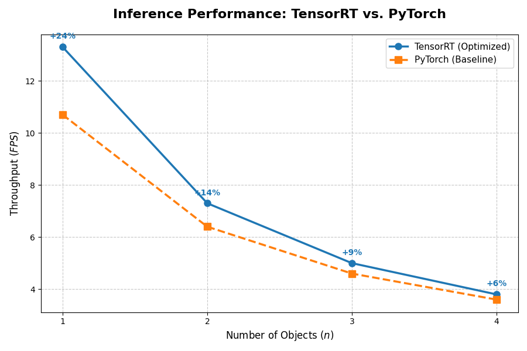

### TensorRT Speedup for SAM2 Inference on Intel RealSense D345 Camera

<p align="center">
  
</p>

##### Quick Setup

1. Installation

```
git clone https://github.com/TanviKulkarni07/sam2_trt.git
```

2. Python Requirements and build dependencies <small> 
system: ubuntu 22.04
GPU: Nvidia GeForce RTX 4070 (16gb RAM)
python=3.10.19
pytorch=2.9.1
tensorrt-cu12==10.15.1.29
pyrealsense2==2.56.5.9235
</small>

```
cd sam2_trt/
conda env create -f environment.yml
```

##### Export SAM2 pytorch models to ONNX models 
Convert the SAM2 model with preloaded 'checkpoint' and 'config' files to ONNX models/.
OR 
download pre-exported ONNX models from [hugging face](https://huggingface.co/TanviKulkarni07/sam2-trt-engines). 
```
python trt_realsense/sam2onnx.py --checkpoint checkpoint --config config --output-dir output-directory
```

##### Export SAM2 ONNX models to TensorRT Engines 
To generate each TRT engine from the respective ONNX model for every 'config_file' in trt_realsense/onnx2trt_config,
first download or create your own ONNX models from the previous step.

```
cd trt_realsense/ && mkdir tiny_onnx_models/
python onnx2trt.py --config onnx2trt_config/config_file
cd ..
```

##### Running TensorRT framework on example video
Refer to trt_video_predictor_example.ipynb. Shows the TensorRT implementation of object tracking in an example video.

##### Benchmarking TensorRT vs Pytorch Inference time
Run
```
python trt_realsense/benchmark_new.py         # For Pytorch inference
python trt_realsense/benchmark_new.py --trt   # For TensorRT-optimized inference
```

| <small>Model</small> | <small>New Object Addition</small> | <small>Propagation Time</small> |
| :--- | :--- | :--- |
| <small>SAM 2.1 Hiera-Tiny (Base)</small> | <small>6.5 FPS</small> | <small>40 FPS</small> |
| **<small>SAM 2.1 Hiera-Tiny (TensorRT)</small>** | **<small>26 FPS</small>** | **<small>39 FPS</small>** |

> **Analysis**: We observe a 4x performance gain during new object addition. While the standard PyTorch decoder for the "tiny" model is already well-optimized, the TensorRT engine provides a critical speedup during the encoder stage for new interactions. Propagation performance is currently capped by CPU overheads.

##### Realtime implementation of TensorRT optimized video segmentation
```
python trt_realsense/infer_realtime.py --checkpoint checkpoints/sam2.1_hiera_tiny.pt --config configs/sam2.1/sam2.1_hiera_t.yaml # For Pytorch inference

python trt_realsense/infer_realtime.py --trt # For TensorRT-optimized inference 
 ```

 
> **Analysis**: TensorRT optimization achieves a throughput increase during the interaction phase by significantly accelerating the encoder step for new object additions. While the standard PyTorch tiny decoder is natively efficient, the overall propagation performance is currently capped by CPU pre-processing overhead and WSL-related USB streaming latency.